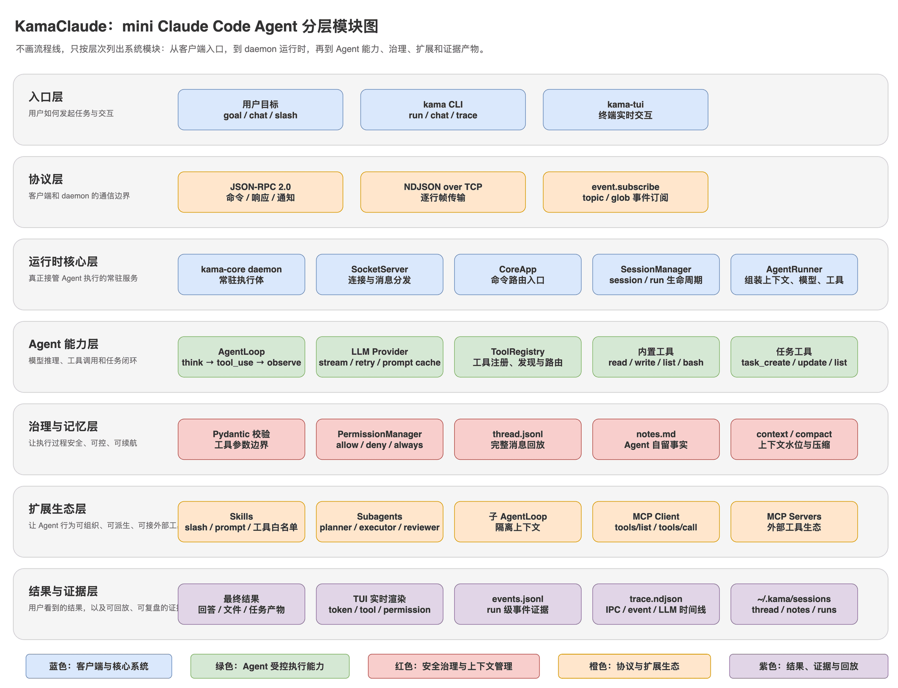

# DongClaude

一个从零实现的、类 Claude Code 的**本地 AI Agent 运行时（mini 版）**。

它不是"调用一次大模型 API"的 Demo，而是把 AI 编程 Agent（Claude Code / Codex / Cursor 这一类）背后最核心的运行机制，用一套完整的本地系统落地：

- 用户输入一个目标，Agent 自主规划下一步并逐步执行
- 模型不只返回文本，还能主动发起工具调用
- 工具调用带参数校验、权限审批、失败分类与重试
- 执行过程不是黑盒，而是通过事件流实时展示到 TUI
- 每次 run 都留下 events、trace、session 记录，方便复盘和排查
- 多轮会话不是简单拼接历史，而是有 thread、notes、context 分层记忆
- 上下文快爆了，不是粗暴截断，而是有水位检测和 compact 压缩
- 复杂任务可以交给子 Agent（Subagents），外部工具通过 MCP 接入

## 架构

**双进程架构**：常驻守护进程 `dong-core` 真正执行任务，`dong`（CLI）和 `dong-tui`（TUI）作为客户端通过类型化 IPC 协议接入。

```
dong-core (daemon)
  └─ 监听 127.0.0.1:7437 (TCP)
       ↑ JSON-RPC 2.0 over NDJSON
dong (CLI)      dong-tui (TUI)
```

一条完整的运行链路：

```
用户目标
  → CLI / TUI
  → JSON-RPC over NDJSON
  → dong-core daemon
  → AgentRunner
  → AgentLoop
  → LLM Provider
  → ToolRegistry
  → PermissionManager
  → EventBus
  → Session Store
  → TUI 实时渲染 / events.jsonl 持久化 / trace 回放
```



## 核心特性

- **ReAct AgentLoop**：模型思考 → 工具调用 → 结果回填 → 多步执行，支持流式 token、扩展思考块和预算控制
- **工具安全**：`ToolRegistry` + `PermissionManager`，调用前做参数校验（pydantic）、权限审批、失败分类与自动重试，工具结果回填模型
- **事件流外化**：`EventBus` 把 token 流、工具调用、审批卡片、上下文水位实时推给 TUI，同时持久化为 events 文件、可回放
- **上下文治理**：session / thread / notes 分层记忆，context 水位检测、tool_result 截断与 compact 压缩，长会话可续航
- **扩展边界**：Skills（目录式/单文件）、Subagents（多 Agent 编排）、MCP 外部工具接入
- **质量保障**：pytest 单元 + 集成测试、mypy strict、ruff

## 技术栈

- **Python 3.12 + asyncio**：守护进程 + 多客户端并发模型
- **pydantic v2**：类型化协议建模（discriminated union），作为 IPC 契约边界
- **anthropic SDK**：流式 LLM 调用（兼容 Anthropic 及 OpenAI 兼容端点）
- **textual**：终端 UI
- **uv**：依赖与项目管理

## 快速开始

前置要求：Python 3.12、[uv](https://docs.astral.sh/uv/)。

```bash
# 1. 同步依赖
uv sync

# 2. 配置环境变量
cp .env.example .env     # 填入 ANTHROPIC_API_KEY 等

# 3. 启动守护进程（终端 1）
uv run dong-core

# 4. 打开 TUI（终端 2）
uv run dong-tui

# 或用 CLI 直接跑任务
uv run dong run --goal "帮我写一个待办清单工具"
```

> TUI 崩了，Agent 任务不会跟着死；CLI、TUI 可同时连接同一个 daemon。

## 项目结构

```
src/dong_claude/
  cli/           # CLI 客户端（dong / dong-core / dong-tui 入口）
  core/
    bus/         # 类型化协议：JSON-RPC 2.0 envelope / commands / events
    transport/   # TCP 传输：服务端 / 客户端（NDJSON 行协议）
    llm/         # LLM Provider 抽象与流式封装
    agents/      # Agent profile 加载（executor / planner / reviewer）
    tools/       # ToolRegistry + 内置工具 + 调用参数校验
    permissions/ # 工具权限审批
    events/      # EventBus 事件分发与持久化
    session/     # 会话与分层记忆（thread / notes）
    compact/     # 上下文水位检测与压缩
    memory/      # 上下文记忆加载
    skills/      # Skill 加载与内置技能
    subagent/    # 子 Agent 注册与派生
    mcp/         # MCP 客户端与服务端接入
    task/        # 任务模型与管理（目标拆解）
    trace/       # 系统级时间线追踪与回放
    app.py       # Core daemon 入口
    config.py    # 四级配置（默认 / TOML / .env / 环境变量）
    loop.py      # ReAct AgentLoop
    runner.py    # AgentRunner 编排
  tui/           # 终端 UI（textual）
```

## 开发路线（S0 → S7）

项目按"解决真实 Agent 工程问题"的方式分成 8 个阶段递进实现：

| 阶段 | 主题 | 解决的问题 |
| --- | --- | --- |
| S0 | 骨架与协议契约 | CLI 与 daemon 通过真实 IPC 完成一次 ping/pong |
| S1 | Agent 最小闭环 | 一次 `run` 从 goal 到 LLM、工具、事件文件完整跑通 |
| S2 | 事件流外化 | AgentRunner 搬进 daemon，CLI/TUI 通过 IPC 订阅同一份事件流 |
| S3 | 自主规划与 TUI | Agent 用任务工具拆解复杂目标，TUI 展示完整执行过程 |
| S4 | 会话与记忆 | 多轮 run 进入同一 session，thread / notes 接住上下文 |
| S5 | 工具安全 | 工具调用前参数校验、权限审批、失败分类与重试 |
| S6 | 上下文治理 | 长会话下 context 水位、tool_result 截断与 compact |
| S7 | 扩展边界 | Skills、Subagents、MCP 让 Agent 可组织、可派生、可接外部工具 |

## 测试与质量

```bash
uv run pytest tests/unit -v        # 单元测试（快速，无需 daemon）
uv run pytest tests/integration -v # 集成测试（fixture 自动拉起 daemon）
uv run pytest tests/ -v            # 全部
uv run ruff check src tests scripts
uv run mypy src
```

## 配置

配置优先级（低 → 高）：**内建默认值 → `~/.dong/config.toml` → `.env` → 系统环境变量**。

常用环境变量（详见 `.env.example`）：

- `DONG_HOST` / `DONG_PORT`：daemon 监听地址
- `DONG_LOG_LEVEL` / `DONG_LOG_FILE` / `DONG_LOG_FORMAT`：日志
- `DONG_LLM_DEFAULT_MODEL`：默认模型
- `DONG_MAX_STEPS`：Agent Loop 最大执行步数（防止死循环）
- `DONG_PERMISSION_TIMEOUT_S`：权限审批超时
- `ANTHROPIC_API_KEY` / `ANTHROPIC_BASE_URL`：LLM 接入凭证

## 更多文档

- [WIRE_PROTOCOL.md](WIRE_PROTOCOL.md)：类型化 IPC 协议定义
- [RUNBOOK.md](RUNBOOK.md)：运维手册
- [CLAUDE.md](CLAUDE.md) / [AGENT.md](AGENT.md)：开发协作指引

## 协议

本项目仅用于学习与研究目的。
